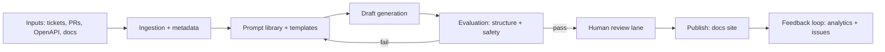

# Reference pipeline

This is a vendor-agnostic pipeline showing how docs + AI can be operationalized.

```mermaid
flowchart LR
  A[Inputs: tickets, PRs, OpenAPI, docs] --> B[Ingestion + metadata]
  B --> C[Prompt library + templates]
  C --> D[Draft generation]
  D --> E[Evaluation: structure + safety]
  E -->|pass| F[Human review lane]
  E -->|fail| C
  F --> G[Publish: docs site]
  G --> H[Feedback loop: analytics + issues]
```

Key idea: **AI is inside the system**, not sitting outside it.

